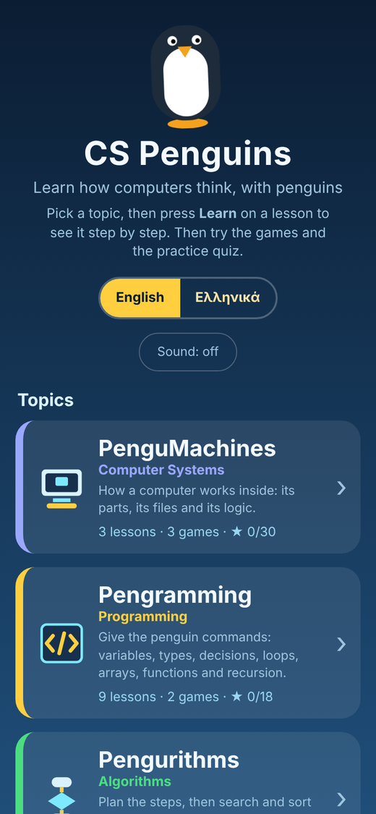
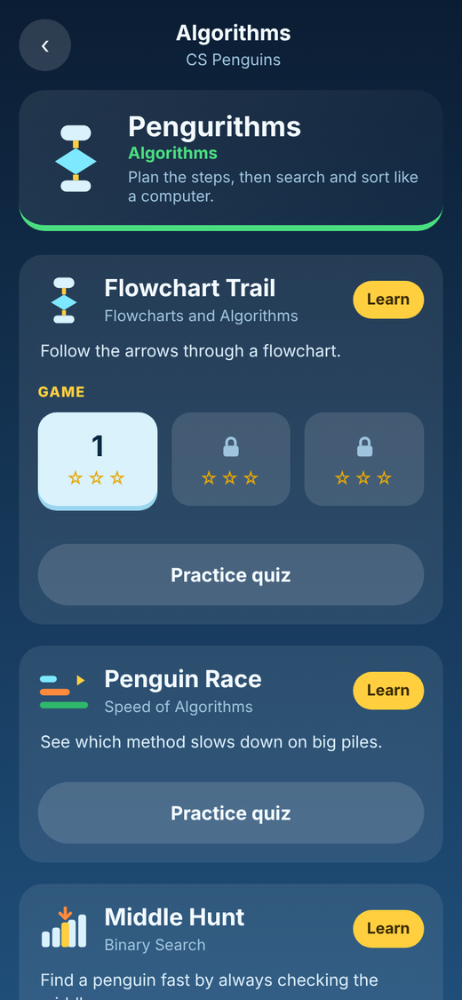
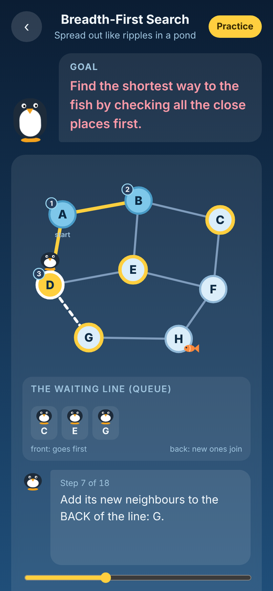
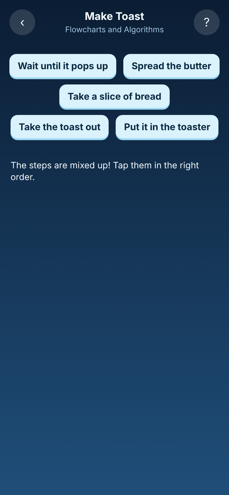
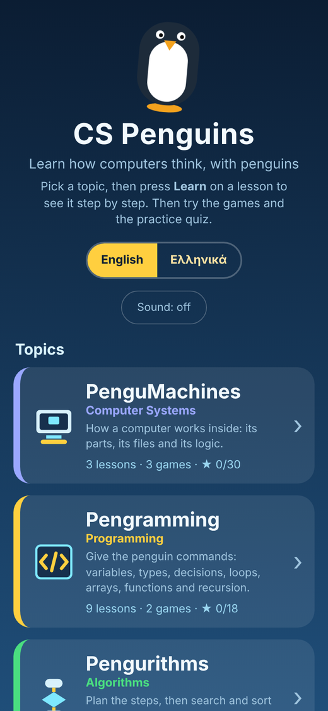

# CS Penguins

**[▶ Play it here](https://paraskevas7.github.io/pengu_game_algorithms/)** (works on phone, tablet and computer, nothing to install) · [Ελληνικά](README.el.md)

[](https://github.com/Paraskevas7/pengu_game_algorithms/actions/workflows/ci.yml)

A free website (and later app) that teaches **computer science** (systems, programming, algorithms, data structures, data, internet safety) to ages 7 to 15 with penguins, in English and Greek. The 39 lessons are shelved in six topics (PenguMachines, Pengramming, Pengurithms, Pengustructures, PenguData, PenguNet), and many have small games (59 game levels in total, 3 stars each).
Plain HTML/CSS/JS with no accounts, no log-in and no tracking. Wrapped for iOS and Android with [Capacitor](https://capacitorjs.com).

<p align="center">
  
  
  
  
  
</p>

## Play it from GitHub (phone or computer)
The game is served by **GitHub Pages** from the `docs/` folder. To switch it on once: repository **Settings > Pages > Build and deployment > Source: Deploy from a branch > Branch: `main` and folder `/docs` > Save**. After a minute or two the game is live at the link above, and anyone can open it in a browser.

## What is in it
**Learn:** a short explanation, an animated example with penguins you can play, pause, step and scrub, the pseudocode with the current line highlighted, and a "good to know" box. **Practice:** game levels (Watch mode and Play mode, 3 / 2 / 1 stars) and a quiz for the other lessons. There is also a daily puzzle and a certificate. Progress is saved only on the device (localStorage).

## How it's built
- **No frameworks, no libraries.** Plain HTML, CSS and JavaScript (23 small modules in `www/js`), so the whole game is one small file that loads instantly and runs anywhere.
- **Algorithms are separate from pictures.** `algos.js` and `graphs.js` compute BFS, DFS, Dijkstra, Prim, Kruskal, Bellman-Ford and the sorting algorithms as lists of steps ("traces"). `frames.js` turns each trace into a plain-language lesson step, and `draw.js` draws it. The same trace feeds the lesson animation, the "Watch" mode and the "Play" mode.
- **Two languages from one code base.** All text goes through `I18n.t(key)`. A test checks that the English and Greek files have exactly the same keys and placeholders and that the Greek is really translated.
- **Tested.** 68 unit tests (`npm test`, run automatically by GitHub on every push) check the algorithms against known answers, that the game levels can be solved, that the star rating works, that every picture draws for every step of every lesson, and that the translations match.
- **Works offline and installs like an app.** A service worker (generated by `tools/build.py`) caches the game, and a web manifest lets you add it to your home screen. `docs/` is the built site that GitHub Pages serves.
- **Private by design.** No accounts, no tracking, nothing leaves the device. Progress is kept in `localStorage`.

## Run it on your computer
```bash
npm run serve        # then open http://localhost:8080
npm test             # unit tests (no install needed)
python3 tools/build.py   # makes dist/index.html, ONE file you can upload to any static host
```
Open it in Chrome and use the phone view (F12 → device toolbar) to see the mobile layout.

## Put it on the web
**GitHub Pages:** see "Play it from GitHub" above. The `docs/` folder is rebuilt by `python3 tools/build.py`.

Upload `dist/index.html` (after `python3 tools/build.py`) to any static host: Netlify Drop (drag and drop), GitHub Pages, Cloudflare Pages or your own server. It needs no server code, no accounts and loads nothing from other sites.

## Put it on the stores
1. **Change the app id** in `capacitor.config.json` (`com.yourname.pengurithm`) to your own reverse-domain id. It is permanent once published.
2. Install and add the platforms:
   ```bash
   npm install
   npx cap add android
   npx cap add ios            # macOS + Xcode only
   npx @capacitor/assets generate   # makes all icon sizes from assets/icon-only.png
   npx cap sync
   ```
3. Build and test on a device or emulator:
   ```bash
   npx cap open android       # Android Studio -> Run
   npx cap open ios           # Xcode -> Run
   ```
4. Each time you change anything in `www/`, run `npx cap sync` again.

### Google Play (Android)
- Create a developer account ($25 one-time).
- In Android Studio: *Build → Generate Signed App Bundle (.aab)*. Keep the keystore file safe - you need it for every update.
- Upload the `.aab` in Play Console, fill in the store listing, content rating, data-safety form (this app collects no data) and a privacy policy URL.
- New personal accounts must run a closed test with testers for a period before production release - check Google's current requirement in Play Console.

### Apple App Store (iOS)
- Needs a Mac with Xcode and an Apple Developer account ($99/year).
- In Xcode set your Team and bundle id, then *Product → Archive → Distribute App → App Store Connect*.
- In App Store Connect add screenshots, description, age rating and privacy details (no data collected) and submit for review.

## Project layout
```
www/index.html        entry page
www/style.css         look and feel
www/js/algos.js       pure algorithm logic (BFS, DFS, quick sort traces) - unit tested
www/js/frames.js      turns the traces into explained lesson steps - unit tested
www/js/game.js        menu, practice levels, progress
www/js/learn.js      the Learn pages (theory text, animated example, controls)
tools/build.py        bundles everything into dist/index.html
test/                 unit tests
assets/               app icon (SVG + PNGs)
capacitor.config.json native wrapper settings
```

## Lessons
39 short lessons, each with an animated player, a storyboard, a short "how it works", a Remember box, a Time formula and pseudocode, in English and Greek.
- Beginner: Binary Numbers, Loops, Variables, If and Else, Find the Bug, Robot Penguin, Flowcharts, Data Types
- Algorithms: Breadth-First Search, Depth-First Search, Bubble, Selection, Insertion, Quick and Merge Sort, Binary Search, Speed of Algorithms
- Data structures and graphs: Stack and Queue, Heap, Topological Sort, Dijkstra, Bellman-Ford, Prim, Kruskal
- Programming ideas: Arrays, Functions, Logic Gates, Recursion
- Computers and digital life: Inside the Computer, Files and Folders, Spreadsheets, Databases, Passwords and Phishing, Digital Citizenship
- Computer science: Data as Numbers, Secret Messages, The Internet, Data and Charts, Teach the Computer (machine learning)

Practice: playable levels for BFS, DFS, Quick Sort, Program the Penguin (`robot.js`) and Light the Lamp (`circuits.js`); a "what happens next?" quiz for the others. See `CURRICULUM.md` for the curriculum map and the originality statement.

## Code layout (`www/js`)
`algos.js` (grid + sorting logic), `graphs.js` (maps, BFS/DFS/Dijkstra/Prim/Kruskal), `frames.js` (quick, merge and bubble sort frames), `draw.js` (SVG/HTML pictures), `content.js` (all lesson text, English), `game.js` (menu + practice levels), `learn.js` (lesson page), `quiz.js` (quiz), `sound.js` (optional sounds), `extras.js` (daily puzzle and certificate). `tools/make_workbook.py` builds the teacher workbook PDFs in `www/worksheets/`; `www/teachers*.html` is the page for schools.
Build with `python3 tools/build.py` (writes `dist/`), test with `npm test`.
